# CartPole PID · MPC · PPO 제어기 비교

> 하나의 **비선형 CartPole 플랜트**를 대상으로 PID, 선형 MPC, PPO 강화학습 제어기를 직접 구현하고, 동일한 조건에서 안정성·정밀도·제어에너지를 비교한 프로젝트입니다.

[](https://www.mathworks.com/products/matlab.html)
[](https://www.python.org/)
[](https://pybullet.org/)
[](LICENSE)

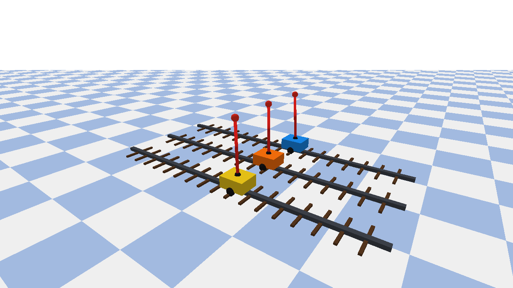

**3D 동시 비교 영상:** [controller_comparison.webm](docs/media/controller_comparison.webm) / https://www.youtube.com/watch?v=3_TuJsbdQDg

---

## 1. 프로젝트 핵심 요약

CartPole은 수레 위의 역진자를 똑바로 세우는 대표적인 불안정 제어 문제입니다. 막대가 조금만 기울어도 중력 때문에 더 빠르게 쓰러지므로, 제어기는 매 순간 수레에 수평 힘을 가해 막대의 각도와 수레의 위치를 함께 안정화해야 합니다.

이 프로젝트에서는 다음 세 접근법을 같은 플랜트에 적용했습니다.

| 제어기 | 핵심 아이디어 | 모델 필요 여부 | 본 실험에서 관찰된 특징 |
|---|---|---:|---|
| Cascade PID | 현재 오차와 누적·변화율로 입력 계산 | 명시적 모델 불필요 | 안정성과 에너지의 균형 |
| Linear MPC | 미래 상태를 예측하고 최적 입력 계산 | 선형 예측 모델 필요 | 가장 높은 각도 정밀도 |
| PPO | 시행착오와 보상으로 정책 학습 | 제어 시 모델 불필요 | 가장 낮은 제어에너지 |

### 최종 결론

- **MPC:** 평균 각도 RMSE가 가장 작았지만 제어에너지가 가장 컸습니다.
- **PID:** 30개 무작위 초기조건에서 100% 성공하며 가장 균형 잡힌 결과를 보였습니다.
- **PPO:** 제어에너지가 가장 작았지만 어려운 초기조건 하나에서 실패하여 성공률이 96.67%였습니다.
- 고전 제어기는 구조와 안정성이 해석하기 쉽고, 강화학습은 모델 없이 효율적인 정책을 얻을 수 있지만 학습 분포와 보상 설계의 영향을 크게 받았습니다.

---

## 2. 전체 실험 흐름

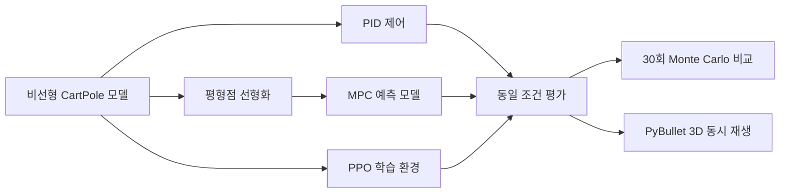

모든 제어기는 동일한 비선형 플랜트, 제어주기, 입력 제한, 종료 조건에서 평가했습니다. MPC만 선형화 모델을 **예측용으로 사용**하며 실제 상태 전파는 PID·MPC·PPO 모두 비선형 식과 RK4 적분기로 수행합니다.

---

## 3. CartPole 상태와 파라미터

상태와 입력을 다음처럼 정의합니다.

$$
\mathbf{s}=
\begin{bmatrix}
x & \dot{x} & \theta & \dot{\theta}
\end{bmatrix}^{\mathsf T},
\qquad u=\text{cart에 가하는 수평 힘}
$$

- $x$: 수레 위치 `[m]`
- $\dot{x}$: 수레 속도 `[m/s]`
- $\theta$: 막대 각도 `[rad]`, $\theta=0$은 수직 위 방향
- $\dot{\theta}$: 막대 각속도 `[rad/s]`
- $u$: 수레에 가하는 힘 `[N]`

| 파라미터 | 값 | 의미 |
|---|---:|---|
| $M$ | 1.0 kg | 수레 질량 |
| $m$ | 0.1 kg | 막대 질량 |
| $l$ | 0.5 m | 회전축에서 막대 질량중심까지 거리 |
| $g$ | 9.8 m/s² | 중력가속도 |
| $\Delta t$ | 0.02 s | 제어주기, 50 Hz |
| $|u|_{\max}$ | 10 N | 액추에이터 제한 |
| $|x|_{\max}$ | 2.4 m | 위치 실패 기준 |
| $|\theta|_{\max}$ | 12° | 각도 실패 기준 |

파라미터 정의: [`matlab/cartpole_params.m`](matlab/cartpole_params.m)

---

## 4. 비선형 동역학

코드에서는 다음 중간항을 먼저 계산합니다.

$$
T=\frac{u+ml\dot{\theta}^{2}\sin\theta}{M+m}
$$

막대의 각가속도와 수레의 가속도는 다음과 같습니다.

$$
\ddot{\theta}=
\frac{g\sin\theta-\cos\theta\,T}
{l\left(\frac{4}{3}-\frac{m\cos^{2}\theta}{M+m}\right)}
$$

$$
\ddot{x}=T-
\frac{ml\ddot{\theta}\cos\theta}{M+m}
$$

따라서 연속시간 상태방정식은

$$
\dot{\mathbf{s}}=
f(\mathbf{s},u)=
\begin{bmatrix}
\dot{x} & \ddot{x} & \dot{\theta} & \ddot{\theta}
\end{bmatrix}^{\mathsf T}
$$

입니다. $\sin\theta$, $\cos\theta$, $\dot{\theta}^{2}\sin\theta$와 분모의 $\cos^{2}\theta$ 때문에 이 시스템은 비선형입니다.

구현:

- [`matlab/cartpole_dynamics.m`](matlab/cartpole_dynamics.m): 연속시간 비선형 미분방정식
- [`matlab/rk4_step.m`](matlab/rk4_step.m): 고정 스텝 4차 Runge–Kutta 적분

### 무제어 상태

제어입력 $u=0$에서 초기 각도가 단지 ±5°여도 약 0.38초 만에 ±12° 실패 경계에 도달합니다.

| +5° | -5° |
|---|---|
| 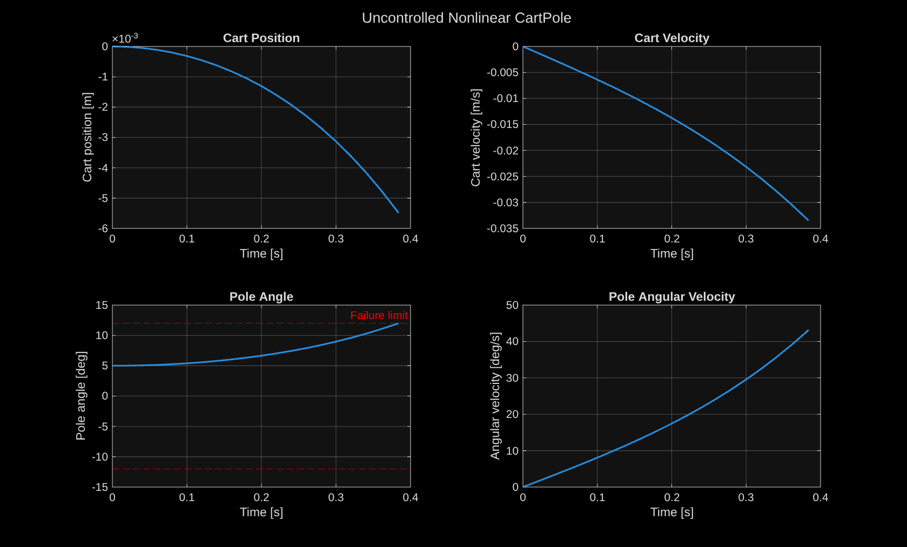 | 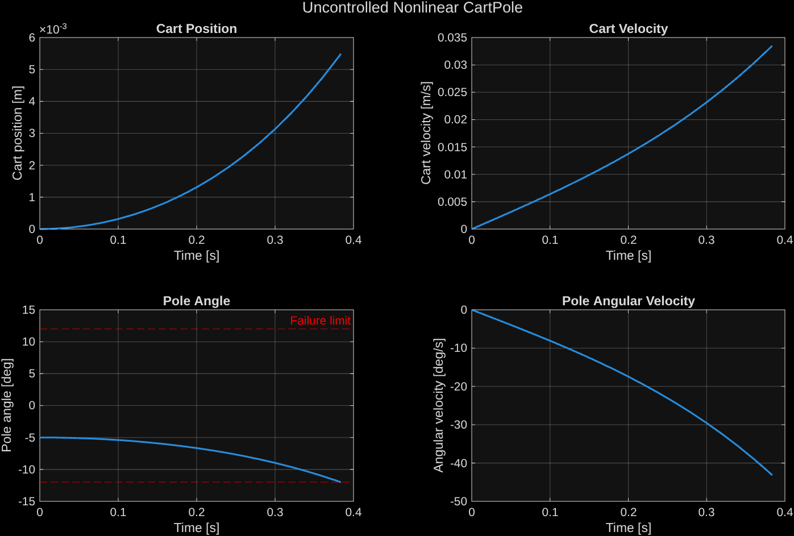 |

이 결과는 수직 평형점이 본질적으로 불안정하며 폐루프 제어가 필요함을 보여줍니다.

---

## 5. 작은 각도 선형화

수직 평형점

$$
\mathbf{s}^{*}=\mathbf{0}, \qquad u^{*}=0
$$

주변에서 Jacobian을 사용해 선형화합니다.

$$
A=\left.\frac{\partial f}{\partial \mathbf{s}}\right|_{(\mathbf{s}^{*},u^{*})},
\qquad
B=\left.\frac{\partial f}{\partial u}\right|_{(\mathbf{s}^{*},u^{*})}
$$

본 파라미터에서 얻은 연속시간 행렬은 다음과 같습니다.

$$
A=
\begin{bmatrix}
0 & 1 & 0 & 0\\
0 & 0 & -0.7171 & 0\\
0 & 0 & 0 & 1\\
0 & 0 & 15.7756 & 0
\end{bmatrix},
\quad
B=
\begin{bmatrix}
0\\0.9756\\0\\-1.4634
\end{bmatrix}
$$

Zero-Order Hold로 $\Delta t=0.02$ s에 이산화한 모델은

$$
\mathbf{s}_{k+1}=A_d\mathbf{s}_k+B_du_k
$$

이며,

$$
A_d=
\begin{bmatrix}
1 & 0.0200 & -0.0001 & 0\\
0 & 1 & -0.0144 & -0.0001\\
0 & 0 & 1.0032 & 0.0200\\
0 & 0 & 0.3158 & 1.0032
\end{bmatrix},
\quad
B_d=
\begin{bmatrix}
0.0002\\0.0195\\-0.0003\\-0.0293
\end{bmatrix}
$$

입니다. 선형 모델은 수직점 근처의 국소 근사이므로 각도가 커질수록 오차가 증가합니다.

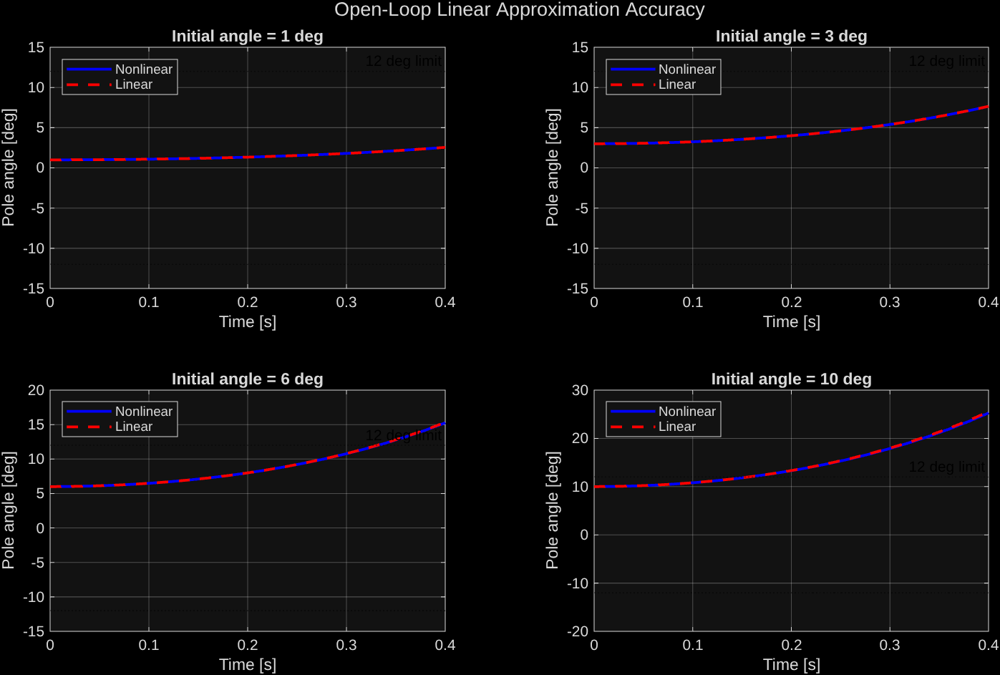

구현:

- [`matlab/linearize_cartpole.m`](matlab/linearize_cartpole.m)
- [`matlab/compare_linear_nonlinear.m`](matlab/compare_linear_nonlinear.m)
- 저장된 모델: [`models/cartpole_linear_model.mat`](models/cartpole_linear_model.mat)

---

## 6. Cascade PID 제어기

단일 PID로 막대 각도만 제어하면 수레가 트랙 끝으로 계속 이동할 수 있습니다. 따라서 바깥쪽 위치 루프가 목표 막대 각도를 만들고, 안쪽 각도 루프가 실제 힘을 만드는 Cascade 구조를 사용했습니다.

### 6.1 바깥쪽 위치 루프

$$
e_x=x-x_{\mathrm{ref}}
$$

$$
\theta_{\mathrm{ref}}=
\operatorname{sat}_{\pm 8^{\circ}}
\left[-\left(
0.12e_x+0.02\int e_xdt+0.16\dot{x}
\right)\right]
$$

### 6.2 안쪽 각도 루프

$$
e_{\theta}=\theta-\theta_{\mathrm{ref}}
$$

$$
u=
\operatorname{sat}_{\pm10}
\left(
60e_{\theta}+1\int e_{\theta}dt+15\dot{\theta}
\right)
$$

적분기는 포화 구간에서 무한히 누적되지 않도록 anti-windup 제한을 적용했습니다.

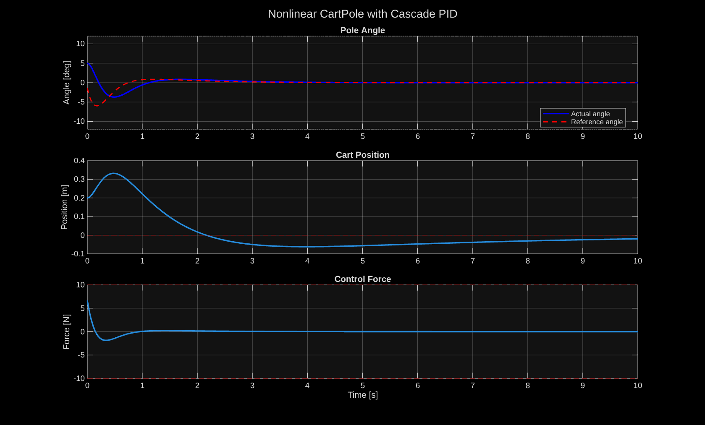

구현: [`matlab/run_pid_controller.m`](matlab/run_pid_controller.m)

---

## 7. 선형 MPC 제어기

MPC는 매 제어주기마다 현재 상태에서 미래를 예측하고, 상태 오차·입력 크기·입력 변화량을 함께 최소화하는 최적화 문제를 풉니다.

$$
\min_{u}
\sum_{i=1}^{N_p}
\|\mathbf{y}_{k+i}-\mathbf{r}\|_{Q_y}^{2}
+
\sum_{i=0}^{N_c-1}
\left(
\|u_{k+i}\|_{R_u}^{2}
+\|\Delta u_{k+i}\|_{R_{\Delta u}}^{2}
\right)
$$

제약조건은

$$
-10\le u_k\le10
$$

입니다.

| 설정 | 값 |
|---|---:|
| Prediction horizon $N_p$ | 40 steps = 0.8 s |
| Control horizon $N_c$ | 10 steps = 0.2 s |
| 출력 가중치 | `[20, 1, 100, 2]` |
| 입력 가중치 | 0.05 |
| 입력 변화율 가중치 | 0.05 |

중요한 점은 MPC 내부 예측에는 선형 모델 $(A_d,B_d)$를 사용하지만, 선택된 힘은 실제 **비선형 플랜트**에 적용된다는 것입니다. 또한 receding horizon 방식으로 첫 번째 입력만 적용한 후 다음 스텝에서 최적화 문제를 다시 풉니다.

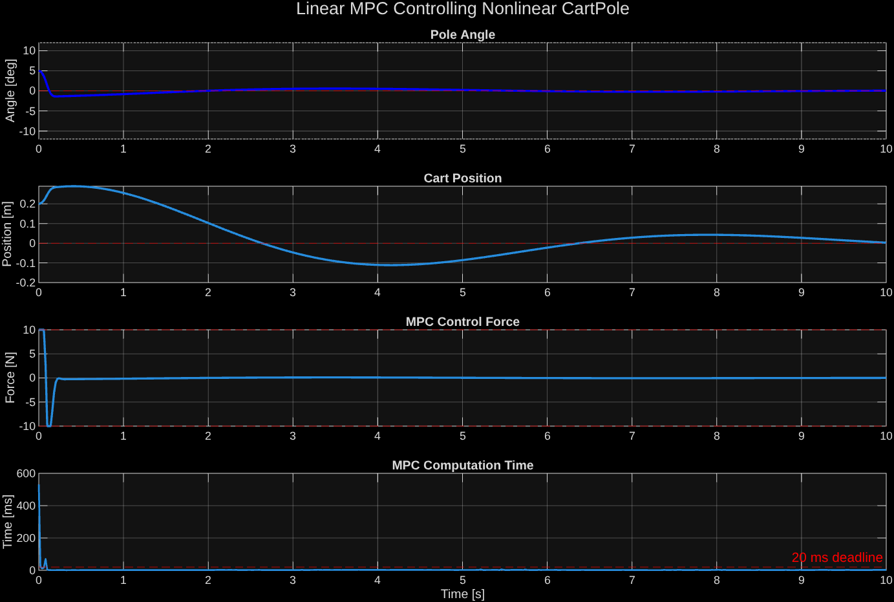

구현: [`matlab/run_mpc_controller.m`](matlab/run_mpc_controller.m)

---

## 8. PPO 강화학습 제어기

### 8.1 환경 정의

PPO 에이전트가 받는 관측값은 물리 상태를 정규화한 벡터입니다.

$$
\mathbf{o}=
\begin{bmatrix}
x/2.4\\
\dot{x}/3\\
\theta/(12^{\circ})\\
\dot{\theta}/3
\end{bmatrix}
$$

연속 행동은 수레에 가하는 힘입니다.

$$
u\in[-10,10]\ \mathrm{N}
$$

학습 초기상태는 매 에피소드 다음 범위에서 무작위로 생성했습니다.

| 상태 | 학습 범위 |
|---|---:|
| $x_0$ | `[-0.5, 0.5] m` |
| $\dot{x}_0$ | `[-0.2, 0.2] m/s` |
| $\theta_0$ | `[-8, 8]°` |
| $\dot{\theta}_0$ | `[-0.3, 0.3] rad/s` |

환경 구현:

- [`matlab/create_cartpole_rl_environment.m`](matlab/create_cartpole_rl_environment.m)
- [`matlab/cartpole_rl_reset.m`](matlab/cartpole_rl_reset.m)
- [`matlab/cartpole_rl_step.m`](matlab/cartpole_rl_step.m)
- [`matlab/normalize_cartpole_observation.m`](matlab/normalize_cartpole_observation.m)

### 8.2 보상함수

정규화 상태 비용은

$$
c_s=\mathbf{o}^{\mathsf T}
\operatorname{diag}(1,0.1,4,0.1)\mathbf{o}
$$

이고, 입력과 입력 변화 비용은

$$
c_u=0.05\left(\frac{u}{10}\right)^2,
\qquad
c_{\Delta u}=0.02\left(\frac{u-u_{\mathrm{prev}}}{10}\right)^2
$$

입니다. 최종 보상은

$$
r=\exp[-(c_s+c_u+c_{\Delta u})]
$$

이며 실패하면 추가로 10을 감점합니다.

$$
r_{\mathrm{failure}}=r-10
$$

따라서 에이전트는 막대를 세우는 것뿐 아니라 수레를 중앙에 유지하고, 작은 힘을 부드럽게 사용하는 방법까지 학습합니다.

### 8.3 PPO 업데이트

PPO는 새 정책과 이전 정책의 확률비

$$
\rho_t(\phi)=
\frac{\pi_{\phi}(u_t|\mathbf{o}_t)}
{\pi_{\phi_{\mathrm{old}}}(u_t|\mathbf{o}_t)}
$$

를 사용해 다음 clipped objective를 최대화합니다.

$$
L^{\mathrm{CLIP}}(\phi)=
\mathbb{E}_t\left[
\min\left(
\rho_t\hat{A}_t,
\operatorname{clip}(\rho_t,1-\epsilon,1+\epsilon)\hat{A}_t
\right)
\right]
$$

$\epsilon=0.2$로 제한하여 한 번의 업데이트로 정책이 지나치게 크게 바뀌지 않게 합니다.

| PPO 설정 | 값 |
|---|---:|
| Hidden units | 64 |
| Discount factor $\gamma$ | 0.99 |
| GAE factor $\lambda$ | 0.95 |
| Experience horizon | 1024 |
| Mini-batch size | 128 |
| Epochs/update | 10 |
| Clip factor $\epsilon$ | 0.2 |
| Entropy weight | 0.01 |
| Actor learning rate | $3\times10^{-4}$ |
| Critic learning rate | $10^{-3}$ |

### 8.4 학습 결과

- 자동 종료 에피소드: **506**
- 최근 50개 에피소드 평균보상: **454.54**
- 자동 종료 기준: 평균보상 450
- 에피소드 최대 길이: 500 steps = 10 s

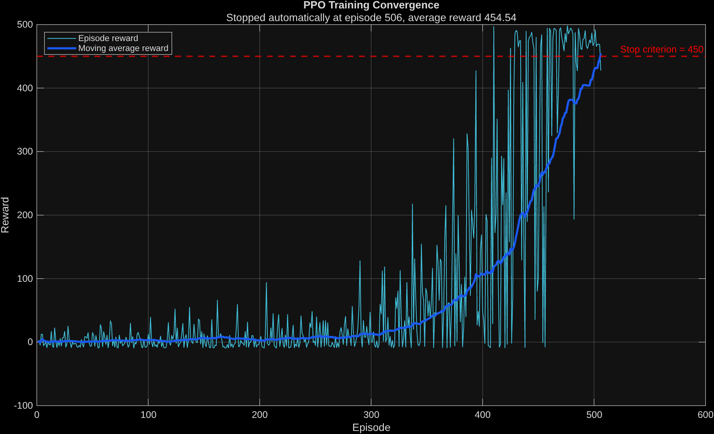

학습 전 무작위 정책은 1초도 버티지 못했지만, 학습된 정책은 고정 평가조건에서 10초를 완주했습니다.

| 학습 전 무작위 정책 | 학습 후 PPO |
|---|---|
| 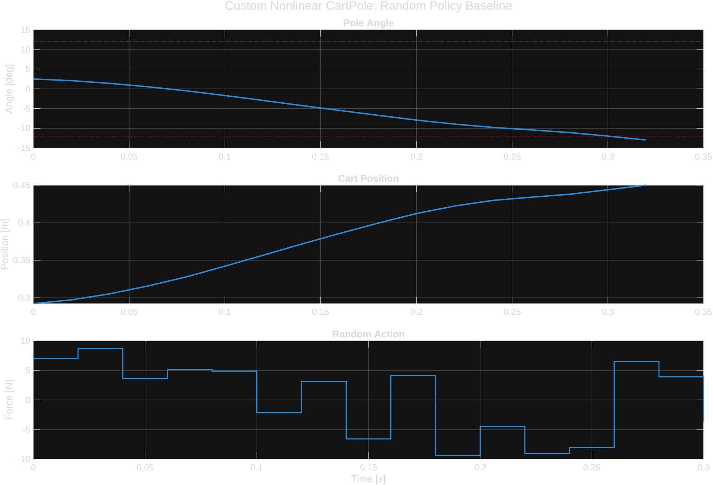 | 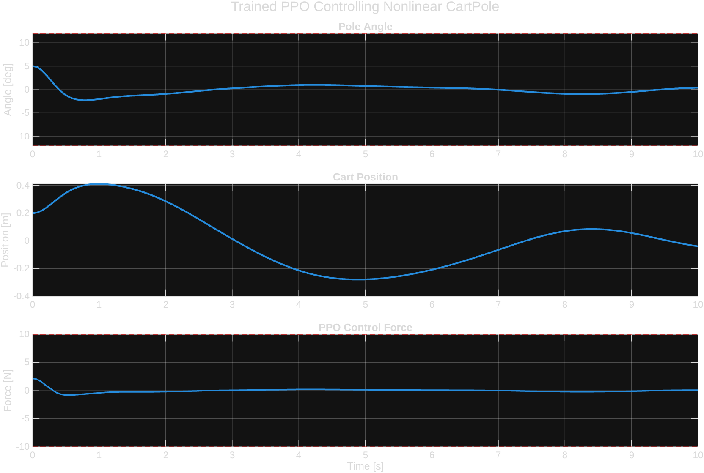 |

학습 및 평가:

- [`matlab/train_ppo_cartpole.m`](matlab/train_ppo_cartpole.m)
- [`matlab/run_ppo_controller.m`](matlab/run_ppo_controller.m)
- 사전 학습 모델: [`models/ppo_cartpole_trained.mat`](models/ppo_cartpole_trained.mat)

---

## 9. 공정한 비교 조건

세 제어기의 성능 차이가 알고리즘에서만 발생하도록 다음 항목을 동일하게 고정했습니다.

| 항목 | 공통 조건 |
|---|---:|
| 실제 플랜트 | 동일한 비선형 CartPole |
| 수치적분 | RK4 |
| 제어주기 | 0.02 s |
| 평가시간 | 10 s, 최대 500 steps |
| 입력 제한 | ±10 N |
| 각도 실패 기준 | ±12° |
| 위치 실패 기준 | ±2.4 m |
| 단일 평가 초기상태 | $[0.2,0,5^{\circ},0]^{\mathsf T}$ |
| PPO 평가 | 탐험 비활성화, deterministic policy |

### 평가 지표

각도 RMSE:

$$
\mathrm{RMSE}_{\theta}=
\sqrt{\frac{1}{N}\sum_{k=1}^{N}\theta_k^2}
$$

위치 RMSE:

$$
\mathrm{RMSE}_{x}=
\sqrt{\frac{1}{N}\sum_{k=1}^{N}x_k^2}
$$

제어에너지:

$$
E_u=\sum_{k=0}^{N-1}u_k^2\Delta t
$$

제어에너지는 실제 전기에너지 자체라기보다는 입력 사용량을 비교하는 지표이며 단위는 $\mathrm{N^2s}$입니다.

---

## 10. 단일 초기조건 비교

| Controller | Success | Angle RMSE | Position RMSE | Max position | Control energy |
|---|---:|---:|---:|---:|---:|
| PID | ✓ | 0.9337° | **0.1054 m** | 0.3320 m | 3.2619 N²s |
| MPC | ✓ | **0.6145°** | 0.1180 m | **0.2896 m** | 15.3566 N²s |
| PPO | ✓ | 1.0984° | 0.2133 m | 0.4109 m | **1.1481 N²s** |

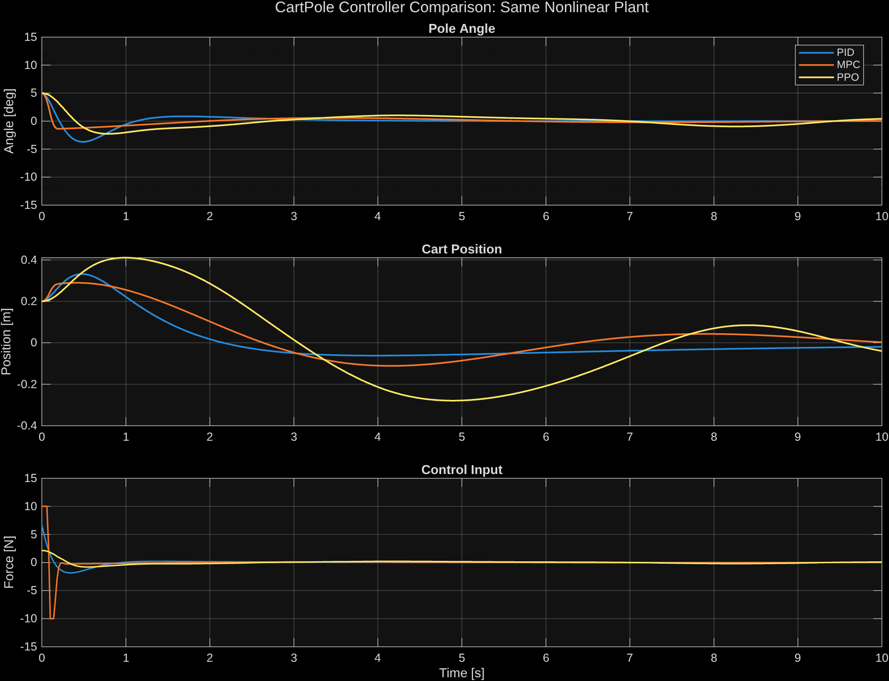

단일 조건에서는 MPC가 각도를 가장 빠르고 정확하게 안정화했지만 초기에 ±10 N 포화를 적극적으로 사용했습니다. PPO는 더 느리고 큰 위치 운동을 허용하는 대신 매우 작은 힘으로 안정화했습니다.

원본 데이터:

- [`results/trajectories/pid_result.csv`](results/trajectories/pid_result.csv)
- [`results/trajectories/mpc_result.csv`](results/trajectories/mpc_result.csv)
- [`results/trajectories/ppo_result.csv`](results/trajectories/ppo_result.csv)
- [`results/tables/controller_comparison.csv`](results/tables/controller_comparison.csv)

---

## 11. 30회 Monte Carlo 강건성 비교

한 초기조건에만 맞는 결과가 되지 않도록 PPO 학습환경과 동일한 범위에서 30개의 초기상태를 생성했습니다. `rng(2026)`으로 난수 시드를 고정했기 때문에 세 제어기는 정확히 같은 30개 상태를 받으며 결과를 재현할 수 있습니다.

### 결과

| Controller | Success rate | Mean survival | Angle RMSE¹ | Position RMSE¹ | Control energy¹ |
|---|---:|---:|---:|---:|---:|
| PID | **100%** | **10.00 s** | 0.9305° | **0.1011 m** | 2.9330 N²s |
| MPC | **100%** | **10.00 s** | **0.6692°** | 0.1304 m | 12.8490 N²s |
| PPO | 96.67% | 9.72 s | 1.0646° | 0.2453 m | **0.9975 N²s** |

¹ RMSE와 에너지는 10초 평가에 성공한 trial만 평균했습니다. 실패한 짧은 에피소드의 작은 누적에너지가 PPO에 유리하게 작용하지 않도록 분리했습니다.

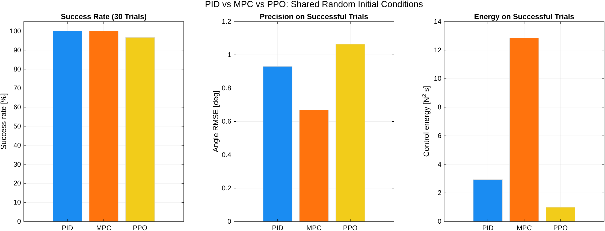

PPO는 30회 중 한 번 다음 초기조건에서 실패했습니다.

$$
\mathbf{s}_0=
[-0.4111,\;-0.0132,\;-6.4508^{\circ},\;-0.2649]^{\mathsf T}
$$

이 trial은 1.6초 후 실패했습니다. 이는 PPO가 평균적으로 에너지 효율적인 반면, 학습이 충분하지 않은 어려운 상태에서는 고전 제어기보다 낮은 강건성을 보일 수 있음을 보여줍니다.

구현 및 데이터:

- [`matlab/run_monte_carlo_comparison.m`](matlab/run_monte_carlo_comparison.m)
- [`results/tables/monte_carlo_summary.csv`](results/tables/monte_carlo_summary.csv)
- [`results/tables/monte_carlo_trials.csv`](results/tables/monte_carlo_trials.csv)

---

## 12. PyBullet 3D 동시 시각화


PyBullet 화면에는 세 CartPole이 같은 시간축에서 동시에 재생됩니다.

- **파랑:** PID
- **주황:** MPC
- **노랑:** PPO
- 화살표: 각 제어기가 가하는 힘의 방향과 상대 크기
- 화면 텍스트: 시간, 위치, 각도, 힘

### 정확한 역할 구분

이 저장소에서 **물리 계산과 제어는 MATLAB 비선형 모델이 담당**하며 PyBullet은 MATLAB이 생성한 CSV 궤적을 3D로 재생합니다. 따라서 PyBullet을 물리 엔진으로 다시 계산한 결과가 아니라, 앞에서 수치적으로 검증한 MATLAB 결과의 시각화입니다.

참고한 [`safe-control-gym`](https://github.com/utiasDSL/safe-control-gym)은 PyBullet 자체를 물리 엔진으로 사용하는 더 큰 벤치마크 프레임워크입니다. 이 프로젝트는 저장소 코드를 복제하지 않고 과제 범위에 맞는 모델과 제어기를 처음부터 구현했습니다.

---

## 13. 저장소 구조

```text
cartpole-pid-mpc-ppo/
├── README.md
├── LICENSE
├── docs/
│   ├── images/                 # README 및 발표용 결과 그림
│   └── media/                  # 3D 비교 영상
├── matlab/
│   ├── cartpole_params.m       # 물리·실험 파라미터
│   ├── cartpole_dynamics.m     # 비선형 연속시간 모델
│   ├── rk4_step.m              # RK4 적분기
│   ├── linearize_cartpole.m    # Jacobian 선형화
│   ├── run_pid_controller.m    # Cascade PID
│   ├── run_mpc_controller.m    # 선형 MPC / 비선형 플랜트
│   ├── cartpole_rl_*.m         # RL 환경 reset/step
│   ├── train_ppo_cartpole.m    # PPO 학습
│   ├── run_ppo_controller.m    # 학습 정책 평가
│   ├── compare_controllers.m   # 단일조건 비교
│   └── run_monte_carlo_comparison.m
├── models/
│   ├── cartpole_linear_model.mat
│   └── ppo_cartpole_trained.mat
├── python/
│   ├── requirements.txt
│   └── visualize_cartpole_3d.py
└── results/
    ├── trajectories/           # PID/MPC/PPO 시계열
    └── tables/                 # 비교·Monte Carlo 요약
```

---

## 14. 실행 방법

### 14.1 요구사항

- Ubuntu 24.04에서 검증
- MATLAB R2026a
- Control System Toolbox
- Model Predictive Control Toolbox
- Reinforcement Learning Toolbox
- Deep Learning Toolbox
- Symbolic Math Toolbox
- Python 3.10
- PyBullet 3.2.7

### 14.2 저장소 받기

```bash
git clone https://github.com/kimsh039/cartpole-pid-mpc-ppo.git
cd cartpole-pid-mpc-ppo
```

### 14.3 MATLAB: 사전 학습 모델로 결과 재현

MATLAB에서 다음을 실행합니다.

```matlab
cd("matlab")

linearize_cartpole
compare_linear_nonlinear

run_pid_controller
run_mpc_controller
run_ppo_controller

compare_controllers
run_monte_carlo_comparison
plot_ppo_training_result
```

`run_monte_carlo_comparison`은 90개의 폐루프 시뮬레이션(PID/MPC/PPO × 30)을 수행하므로 다른 스크립트보다 오래 걸립니다.

### 14.4 PPO를 처음부터 다시 학습

```matlab
cd("matlab")
train_ppo_cartpole
```

최근 50개 평균보상이 450에 도달하거나 최대 1500에피소드가 끝나면 학습이 종료되고 `models/ppo_cartpole_trained.mat`에 저장됩니다.

### 14.5 Python 환경과 3D 실행

표준 `venv` 사용:

```bash
cd python
python3 -m venv .venv
source .venv/bin/activate
python -m pip install -r requirements.txt
```

또는 [`uv`](https://docs.astral.sh/uv/) 사용:

```bash
cd python
uv venv --python 3.10 .venv
uv pip install --python .venv/bin/python -r requirements.txt
```

세 제어기 동시 재생:

```bash
python visualize_cartpole_3d.py --controller ALL --loop
```

절반 속도:

```bash
python visualize_cartpole_3d.py \
  --controller ALL \
  --speed 0.5 \
  --loop
```

개별 제어기:

```bash
python visualize_cartpole_3d.py --controller PID --loop
python visualize_cartpole_3d.py --controller MPC --loop
python visualize_cartpole_3d.py --controller PPO --loop
```

---

## 15. GitHub를 보여주며 발표하는 순서

### 1) 문제 소개

README 맨 위의 3D 그림을 보여주며 다음처럼 시작합니다.

> “동일한 비선형 CartPole에 PID, MPC, PPO 세 제어기를 구현하고 안정성, 정밀도, 입력에너지를 비교했습니다.”

### 2) 무제어 시스템

±5° 그래프를 보여주며 작은 오차도 약 0.38초 만에 실패 경계에 도달한다는 점을 설명합니다.

### 3) 모델링과 선형화

비선형 식에서 $\sin\theta$, $\cos\theta$ 항을 짚고, MPC에는 수직점 주변의 Jacobian 선형 모델을 사용했지만 실제 플랜트는 계속 비선형이라는 점을 강조합니다.

### 4) PID

위치 외부 루프와 각도 내부 루프의 역할을 설명합니다. “각도만 세우면 수레가 계속 이동할 수 있기 때문에 cascade 구조를 사용했다”고 말하면 됩니다.

### 5) MPC

0.8초 앞을 예측하고 첫 입력만 적용한 뒤 다시 최적화하는 receding horizon 개념을 설명합니다.

### 6) PPO

상태·행동·보상 구성을 먼저 설명한 후 학습곡선에서 평균보상이 506에피소드에 450을 넘은 것을 보여줍니다.

### 7) 공정성

세 제어기가 동일한 비선형 플랜트, 초기조건, 50 Hz, ±10 N 제한을 사용했음을 보여줍니다. 이 부분이 비교 실험의 신뢰성을 결정합니다.

### 8) 결과

단일조건 그래프로 움직임을 비교하고, Monte Carlo 막대그래프로 최종 결론을 제시합니다.

> “MPC는 가장 정밀했고, PID는 가장 균형 잡혔으며, PPO는 가장 적은 에너지를 사용했습니다. PPO는 한 어려운 조건에서 실패하여 모델 기반·고전 제어 대비 강건성의 한계도 확인했습니다.”

### 9) 3D 데모

PyBullet에서 `--controller ALL --loop`를 실행해 세 제어기의 움직임 차이를 동시에 보여줍니다.

---

## 16. 예상 질문과 답변

<details>
<summary><strong>Q1. PID도 모델이 필요한 것 아닌가요?</strong></summary>

게인을 설계하고 튜닝할 때 시스템 특성을 이해하는 것은 중요하지만, 실행되는 PID 식 자체는 질량·길이 같은 동역학 파라미터를 직접 사용하지 않습니다. 반면 MPC는 상태 예측을 위해 $A_d,B_d$ 모델을 명시적으로 사용합니다.
</details>

<details>
<summary><strong>Q2. MPC는 선형인데 왜 비선형 CartPole을 제어할 수 있나요?</strong></summary>

막대가 수직 근처에 있으면 선형화 오차가 작습니다. MPC가 빠르게 각도를 작은 범위로 되돌리면 이후에도 선형 예측이 유효합니다. 초기각도가 크거나 모델 파라미터가 크게 달라지면 성능이 저하될 수 있습니다.
</details>

<details>
<summary><strong>Q3. PPO가 학습했는데 왜 PID보다 성능이 낮나요?</strong></summary>

PPO의 목표는 각도 RMSE만 최소화하는 것이 아닙니다. 보상에는 위치, 힘, 힘 변화량이 동시에 포함됩니다. 그래서 PPO는 더 느린 위치 운동을 허용하면서 힘을 적게 쓰는 정책을 학습했습니다. 또한 한 번의 seed와 제한된 학습량 때문에 어려운 초기상태에 대한 강건성이 완전하지 않습니다.
</details>

<details>
<summary><strong>Q4. MPC 에너지가 큰 이유는 무엇인가요?</strong></summary>

각도 출력 가중치가 100으로 매우 크기 때문에 초기에 ±10 N 포화를 적극적으로 사용해 각도를 빠르게 세웁니다. 더 큰 입력 가중치나 입력 변화율 가중치를 사용하면 에너지는 줄지만 응답속도와 각도 오차가 커질 수 있습니다.
</details>

<details>
<summary><strong>Q5. PPO 비교가 공정한가요?</strong></summary>

평가에서는 PPO의 탐험을 끄고 deterministic action을 사용했습니다. 모든 제어기는 같은 초기상태, 같은 비선형 RK4 플랜트, 같은 제어주기와 힘 제한을 사용했습니다. 학습 중에만 PPO가 무작위 초기상태를 경험합니다.
</details>

<details>
<summary><strong>Q6. PyBullet이 실제 물리 시뮬레이터인가요?</strong></summary>

PyBullet 자체는 물리 엔진이지만, 이 프로젝트의 3D 코드는 검증된 MATLAB CSV를 재생하는 시각화 계층으로 사용합니다. 따라서 발표할 때 “PyBullet에서 다시 물리를 계산했다”가 아니라 “MATLAB 제어 결과를 PyBullet로 3D 시각화했다”고 설명해야 합니다.
</details>

---

## 17. 한계와 확장 방향

- PPO 학습은 하나의 random seed로 수행했습니다. 여러 seed의 평균과 표준편차를 비교하면 더 엄밀합니다.
- Monte Carlo는 초기상태 변화만 평가했습니다. 질량, 막대 길이, 센서 잡음, 외력도 무작위화할 수 있습니다.
- MPC는 수직점의 단일 선형 모델을 사용합니다. 비선형 MPC 또는 successive linearization으로 큰 각도 성능을 개선할 수 있습니다.
- PPO에 safety filter 또는 control barrier function을 결합하면 실패 가능성을 줄일 수 있습니다.
- PyBullet을 단순 재생이 아닌 실제 플랜트로 사용하고 MATLAB 정책을 배포하는 sim-to-sim 검증으로 확장할 수 있습니다.
- ROS 2 또는 Gazebo를 추가하면 제어기와 플랜트를 독립 노드로 구성할 수 있지만, 본 과제의 핵심 비교에는 필수 요소가 아닙니다.

---

## 18. 참고 자료

- Z. Yuan et al., “Safe-Control-Gym: A Unified Benchmark Suite for Safe Learning-Based Control and Reinforcement Learning in Robotics,” *IEEE Robotics and Automation Letters*, 2022.
- [safe-control-gym GitHub](https://github.com/utiasDSL/safe-control-gym)
- [MathWorks Reinforcement Learning Toolbox](https://www.mathworks.com/products/reinforcement-learning.html)
- [MathWorks Model Predictive Control Toolbox](https://www.mathworks.com/products/model-predictive-control.html)
- [PyBullet](https://pybullet.org/)

이 프로젝트는 `safe-control-gym`을 참고 자료로만 사용했으며, CartPole 동역학·PID·MPC·PPO 환경·비교 실험·3D 재생 코드는 과제 범위에 맞춰 직접 작성했습니다.
